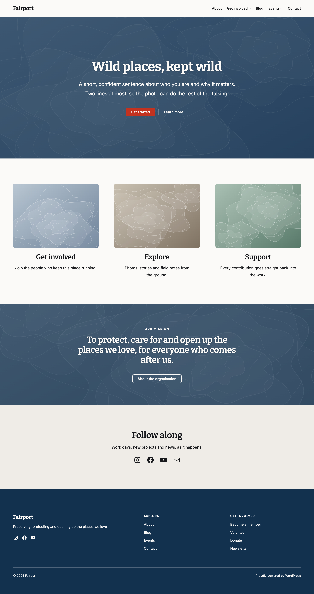
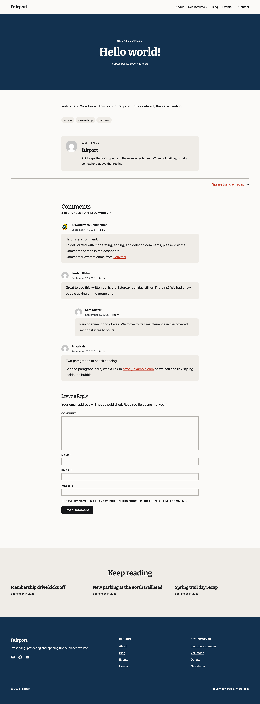
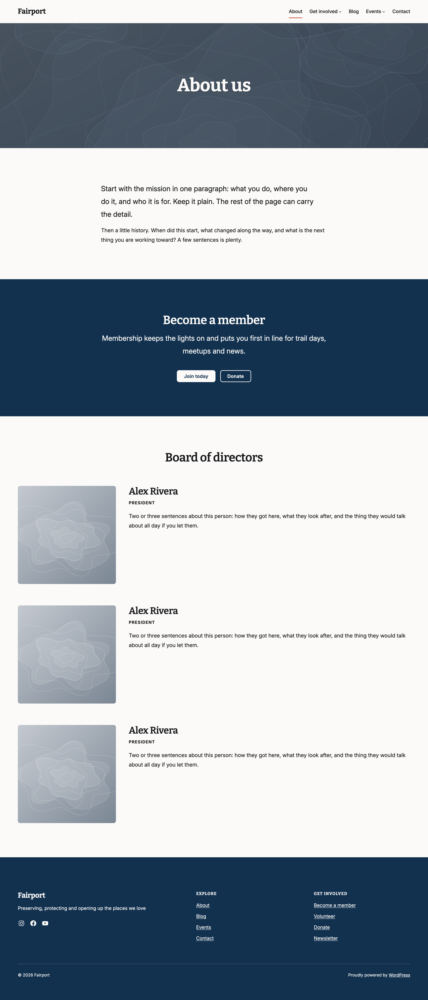
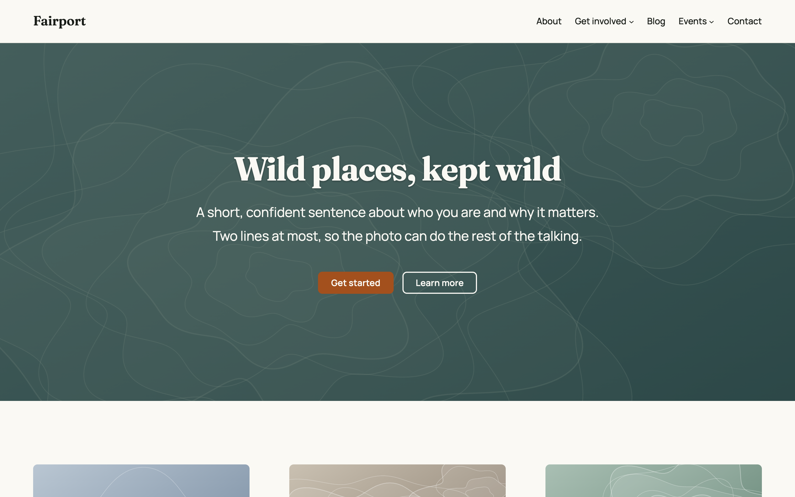
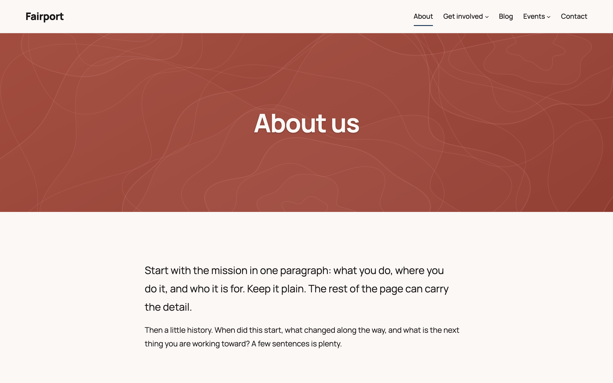
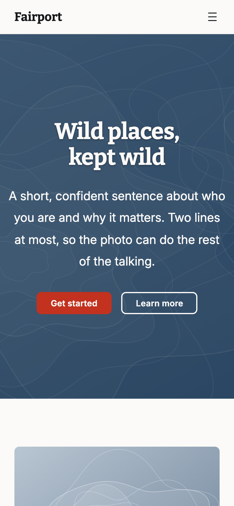

# Fairport

[](https://playground.wordpress.net/?blueprint-url=https://raw.githubusercontent.com/philhoyt/fairport/main/.github/blueprint.json)

A WordPress block theme for clubs, coalitions and small non-profits, built for the WordPress Theme Directory.

Big photo mastheads with a single colour overlay, a serif and sans type pairing (Bitter and Inter), three-up signposts and ready-made call to action bands. Three section styles restyle a band from the block Styles panel; three colour palettes and four typography presets restyle the whole site from Global Styles.

The Playground demo is a throwaway site with the latest release installed, a Home and About page built from the starter patterns, and `WP_DEBUG` on.

See [`readme.txt`](readme.txt) for the directory listing.



## A closer look











## Requirements

- WordPress 6.6+ (section styles)
- PHP 7.4+
- WooCommerce (optional) for the store templates
- Node.js 20+ and Composer for development

## Installation

Download `fairport.zip` from the [latest release](https://github.com/philhoyt/fairport/releases/latest), then in WordPress go to Appearance > Themes > Add New > Upload Theme, choose the zip and click Install Now, then Activate.

## Usage

- Pages and posts use the featured image as their masthead. Without one, pages get a plain `secondary` colour band.
- To build a page like the demo Home, add a page, pick Pages > Home in the pattern chooser, and set the template to "Page (No Title)".
- Section styles (Secondary, Tint, Accent) are in the block Styles panel of a Group, Columns or Column block.
- Colour palettes (Navy Blue, Forest Green, Scarlet Red) and typography presets (Bitter & Inter, Fraunces & Manrope, Manrope, Bitter) are under Styles in the Site Editor.
- With WooCommerce active, Fairport supplies templates for the shop, product archives, product search, single products, cart, checkout, My Account, order confirmation and the coming soon page. Store styles load only while WooCommerce is active.

## Development

```bash
npm install && composer install
npm run start           # dev build with watch
npm run build           # production build to dist/
npm run lint:js         # ESLint
npm run lint:scss       # Stylelint
npm run lint:php        # PHP CodeSniffer
composer analyse        # PHPStan
npm run validate:blocks # parse every pattern, template and part with the editor's block validator
```

`dist/` is committed, because the directory zip, GitHub installs and Playground have no build step. Run `npm run build` and commit the result with any SCSS change.

`bin/wp.sh` wraps WP-CLI for the `fairport` Local site. `npm run screenshot -- http://fairport.local` regenerates `screenshot.png`; `npm run previews -- http://fairport.local` regenerates the README images in `.github/` (it switches palettes through `bin/preview-variation.php` and resets afterwards). `validate:blocks` registers WooCommerce's blocks from the running site, so it needs WooCommerce active on `fairport.local`.

### Tests

The tests run in Docker through `wp-env`, with WooCommerce's latest stable release and a seeded store:

```bash
npm run wp-env start # WordPress + WooCommerce on :8888, tests site on :8889
npm run test:php     # PHPUnit inside wp-env
npm run test:e2e     # Playwright specs against the :8889 tests site
```

CI (`.github/workflows/ci.yml`) runs the linters, a check that the committed `dist/` matches a fresh build, and both test suites on every pull request, on pushes to `main`, and weekly.

## Releases

Bump the version in `style.css` (`Version:`), `readme.txt` (`Stable tag` and a changelog entry) and `package.json`, commit, then push a `v`-prefixed tag:

```bash
git tag v1.2.0 && git push origin main --tags
```

The release workflow (`.github/workflows/release.yml`):

1. Builds `dist/`.
2. Fails if the three version strings do not match the tag.
3. Copies the theme into `build/fairport/`, honouring `.distignore`, and zips it as `fairport.zip`.
4. Checks the zip contains the core theme files and no development files.
5. Creates a GitHub release with the zip attached and the version's `readme.txt` changelog entry as the body.

Releases are not flagged pre-release, because GitHub's `releases/latest` skips those. The Playground blueprint installs `releases/latest/download/fairport.zip`.

To build the same zip locally:

```bash
npm run build
rm -rf build && mkdir -p build/fairport
rsync -a --exclude-from=.distignore --exclude=build ./ build/fairport/
(cd build && zip -qr ../fairport.zip fairport)
```

## License

GPL-2.0-or-later. Bundled fonts are SIL OFL 1.1 (licences in `assets/fonts/`); placeholder artwork in `assets/images/` is CC0.
